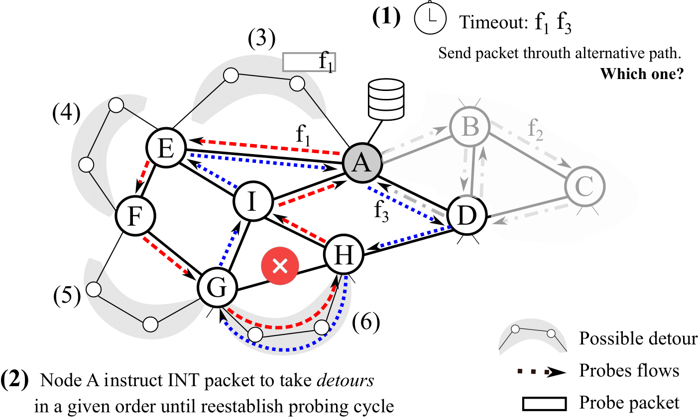

# About InPatching
**InPatching** is an in-network fast fail-over approach to INT-based monitoring mechanisms. It allows to recover from link failures in the data plane by performing detours directly in the data plane (with no control plane intervention). Follow the example:

  <!--- comentario:  --->
  

    <em>Fig: InPatching schema</em>

The figure above summarizes the **InPatching** procedure. We assume a link may failure due to several reasons (e.g., port misconfiguration, port down, cabble issues, etc.). To detect these failures, we designate a set of master data planes - in this case, switch **A** - where the main logic is applied. The master data plane is responsible for detecting the link failures by setting a timeout between each packet of the same flow (Step 1).  Then (Steps 2-6), it designates the next switch upon which a detour must be performed in an attempt to discover and resolve the network's point of failure on the original path until it finds a path detour where the timeout threshold remains low (Step 6 - link G-H) - i.e., we maintain the performed detour which deviated the link failure.

# Requirements
[**P4 Utils**](https://github.com/nsg-ethz/p4-utils)

# Contributing
PRs are very much appreciated. For bugs/features, consider creating an issue before sending a PR.

# Documentation
For further instructions, please read our [wiki](https://github.com/arielgoes/InPatching/wiki).
